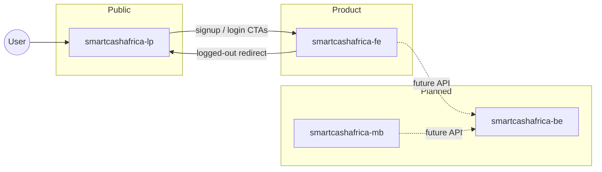

# Architecture

Overview of how SmartCash Africa projects fit together and how the active front-ends are structured.

## System context



| Component            | Responsibility                                     |
| -------------------- | -------------------------------------------------- |
| `smartcashafrica-lp` | Marketing, conversion, product education           |
| `smartcashafrica-fe` | Auth, onboarding, PFM features                     |
| `smartcashafrica-be` | Auth, accounts, transactions, AI (not implemented) |
| `smartcashafrica-mb` | Native mobile experience (not implemented)         |

## Cross-project linking

URL helpers live in each project:

- **LP** — `src/lib/links.ts` → `appLinks` (signup, login, terms, privacy)
- **App** — `src/lib/links.ts` → `lpLinks` (home / marketing)

Environment variables:

| Variable       | Set in | Purpose                      |
| -------------- | ------ | ---------------------------- |
| `VITE_APP_URL` | LP     | Base URL of the web app      |
| `VITE_LP_URL`  | App    | Base URL of the landing page |

Dev defaults (`localhost:5173` / `localhost:5174`) require no `.env` files.

## smartcashafrica-fe structure

```
src/
├── main.tsx                 # Provider tree
├── App.tsx                  # Routes (lazy-loaded pages)
├── components/
│   ├── auth/                # AuthLayout, ProtectedRoute, PublicRoute
│   ├── layout/              # AppLayout, Sidebar, TopNav, ProfileMenu
│   ├── search/              # Command palette (⌘K)
│   ├── charts/              # MiniSparkline
│   └── ui/                  # Button, Card, Input, modals, etc.
├── context/
│   ├── AuthContext.tsx      # User session (localStorage)
│   ├── AppDataContext.tsx   # Accounts, transactions, goals (localStorage)
│   ├── ThemeContext.tsx     # light / dark / system
│   ├── I18nContext.tsx      # en, fr, wo
│   └── ToastContext.tsx     # Action feedback
├── pages/                   # Route-level screens
├── hooks/                   # useChartTheme, etc.
├── lib/
│   ├── mock-data.ts         # Seed data
│   ├── data-helpers.ts      # Budgets, health score, formatting
│   ├── export.ts            # CSV export
│   ├── links.ts             # LP URL helper
│   └── i18n/                # Locale catalogs
└── types/
    └── finance.ts           # Domain types
```

### Provider hierarchy

```
ThemeProvider
  └── AuthProvider
        └── AppDataProvider
              └── I18nProvider
                    └── ToastProvider
                          └── App (Router)
```

### Routing model

| Guard             | Routes                                          |
| ----------------- | ----------------------------------------------- |
| `HomeRoute`       | `/` — redirect to LP or dashboard               |
| `PublicRoute`     | `/login`, `/signup`, `/forgot-password`         |
| `ProtectedRoute`  | `/onboarding`, all app routes under `AppLayout` |
| Public (no guard) | `/terms`, `/privacy`                            |

Protected routes use **React.lazy** + `Suspense` with `PageSkeleton` for code splitting.

### Data layer (current)

There is no backend yet. State is persisted in `localStorage`:

| Key                     | Content                                      |
| ----------------------- | -------------------------------------------- |
| `smartcash-user`        | Authenticated user                           |
| `smartcash-onboarded`   | Onboarding completion flag                   |
| `smartcash-app-data`    | Transactions, accounts, goals, notifications |
| `smartcash-preferences` | Language, theme, notification prefs          |
| `smartcash-profile`     | Phone, country                               |

`AppDataContext` merges mock seed data with user mutations (add transaction, connect account, etc.).

### Internationalization

Locales: **English**, **French**, **Wolof** (`wo`).  
Translation keys are dot-path strings; catalogs live in `src/lib/i18n/{en,fr,wo}.ts`.

## smartcashafrica-lp structure

```
src/
├── main.tsx                 # I18nProvider, DemoProvider
├── App.tsx                  # Single-page section stack
├── components/
│   ├── layout/              # Header, Footer
│   ├── sections/            # Hero, Features, Pricing, FAQ, …
│   └── ui/                  # Button, Reveal, AnimatedCounter, etc.
├── context/
│   ├── I18nContext.tsx      # en, fr
│   └── DemoContext.tsx      # Interactive demo modal state
├── hooks/                   # useInView, useAnimatedCounter, useActiveSection
└── lib/
    ├── links.ts             # App URL helper
    └── i18n/                # en, fr catalogs
```

The LP is a **single-page** marketing site (no client router). Sections are composed in `App.tsx` in scroll order.

### LP sections (in order)

1. Hero  
2. Partner strip  
3. Trust metrics  
4. Problem / solution  
5. Features  
6. How it works  
7. AI advisor  
8. Financial health  
9. Testimonials  
10. Security  
11. Pricing  
12. FAQ  
13. Final CTA  
14. Footer  

## Planned extensions

### smartcashafrica-be

Expected responsibilities:

- User authentication (JWT or session)
- Bank / mobile-money account aggregation
- Transaction sync and categorization
- Savings goals and budget rules
- AI advisor and health-score computation
- Notifications and report generation

The front-end types in `smartcashafrica-fe/src/types/finance.ts` are a useful contract for future API design.

### smartcashafrica-mb

Planned **Flutter** client (Bloc/Cubit, Firebase per team conventions). Will share backend APIs with the web app once `smartcashafrica-be` exists.

## Conventions

- Path alias `@/` → `src/` in both Vite projects
- Shared visual language (emerald primary, navy, Inter)
- LP defaults to French when the browser locale is French; app supports three locales
- Errors in UI: prefer inline `SelectableText.rich` (app convention) over snackbars for form errors
- Private package names; not published to npm
